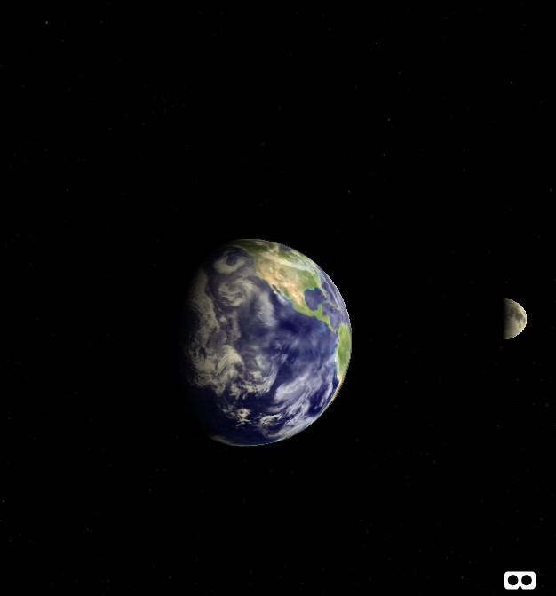

# A-Frame Earth

You can test it live here:  https://supertobi.github.io/aframe-earth-with-moon/

I'm just playing around with A-frame. Not astronomically accurate! 

[A-Frame](https://aframe.io) is a web framework for building virtual reality experiences. 

### Models/Textures/Etc
Moon Image and displacement map are from NASA:

[https://svs.gsfc.nasa.gov/4720](https://svs.gsfc.nasa.gov/4720)

Background Stars v2 from the Charles Hayden Planetarium – Museum of Science, Boston:

[https://thefulldomeblog.com/2013/11/13/background-stars-v2/](https://thefulldomeblog.com/2013/11/13/background-stars-v2/)
